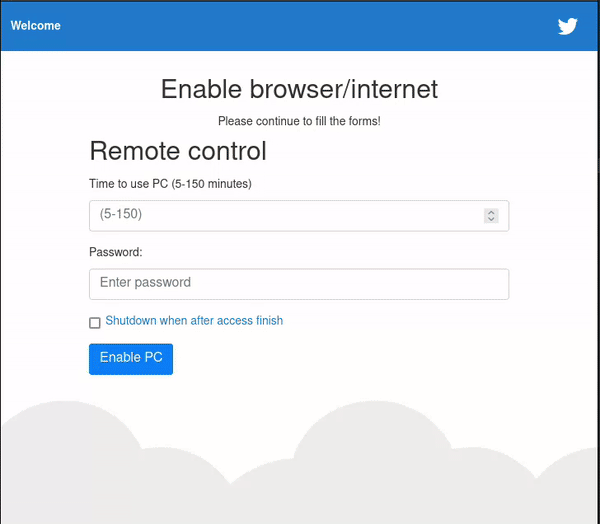

# Simple PC-controller
### About the app
This app was created quickly to control the a target computer by limiting its functional such as internet usage from another computer. The main idea was to create a timer that shutsdown or/and stops the possiblity of using internet in the target pc. The majority of code is written with Angular.

## Features
### Main 
* Login and set time
* Poweroff computer in certain time
* Can send a signal to instant stop computer network or/and poweroff
* all data is stored locally and is always accesable even when application is deleted
* And more...

## How the app looks

